# Introduction 

In this tutorial we will learn about what is data, what is a variable, and the types of scales that variables can be measured on. We will learn by doing using the data set, `countyrent.xlsx`, which is a merge of data from Zillow and the United States Census. The data set includes the median rental price for two-bedroom apartments advertised on Zillow, and economic characteristics of the same counties provided by the U.S. Census. 

# From Concepts to Data 

It is useful to think explicitly what we mean by variables, data, and measurement. They are commonly used words and you may have a good idea what they mean, but sometimes subtleties in their meaning have implications for how we work with them.

## Variables and Observations 

**'Concept':** Generalized idea of something that represents something interesting to someone, and that is likely related to other concepts.

For example, in the data set above, we could say that "How much people pay in rent" is a *concept*. It is not a variable.

**'Variable':** A variable is a concept that is carefully defined so that it can be precisely quantified or categorized. 

How much people pay in rent is not yet a variable, because it is not precisely defined. Pay in rent for what?  Apartments or houses? Number of bedrooms? When? This year, last year? 

The spreadsheet looks like the following. The first tab contains the data and the second tab contains descriptions of the variables. 

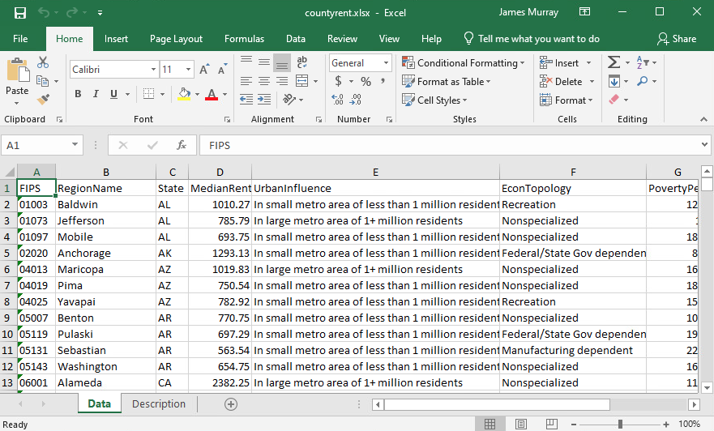

<i><b>Screenshot of countyrent.xlsx in Microsoft Excel</b></i>

The variable names are given in the first row of the data tab, and each row that follows is an observation for an individual county in the United States. The variable names themselves may reveal the concept. The second tab, `Description`, gives the precise descriptions for each variable.

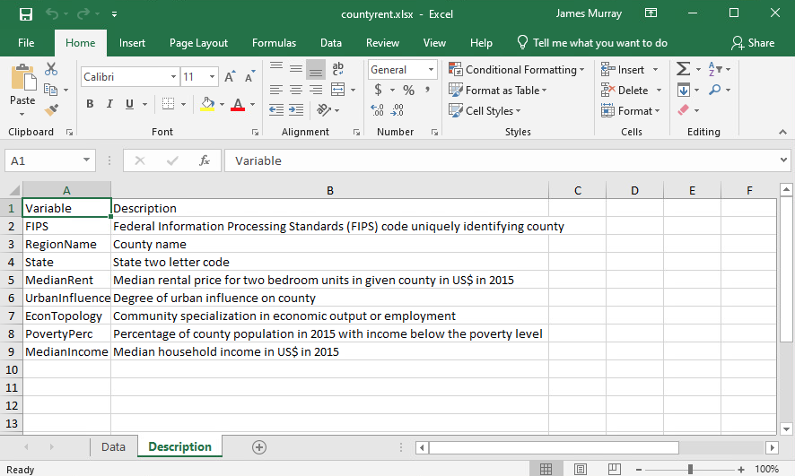

<i><b>Screenshot of variable descriptions in Microsoft Excel</b></i>

For example, the fourth variable is called `MedianRent` and is associated with our concept, "How much people pay in rent." Is it well defined? The description tab shows it is precisely defined as the median rental price for two-bedroom units in a given county in 2015 and expressed in U.S. dollars. 

You may have noted that this description hinted at the answer to the question, "Where?" This is defined based on the other variables. The second and third variables give the county name and U.S. state (and the first variable gives the unique FIPS code associated with each county). 

**'Observation':** An observation is the particular value a variable takes for one of the items being measured, or the values for a set of variables for one of the items being measured.

**'Observation level':** A description of the unit, individual, entity, etc., that is measured.

In a typical spreadsheet, the observations are given by the rows.  The observation level is an *individual county*.  Each county has a unique observation, which is a measurement for each of the variables.  

## Data and Statistics 

Now that we understand what are concepts, variables, and observations, we can move on to more precisely defining data. First, let us understand the difference between a population and a sample.

**'Population':** All possible observations corresponding to a study. This is possibly infinite.

**'Sample':** A subset of the observations in population that are measured.

Usually it is impossible to collect all observations in a population, so we focus on a sample. One would hope that the sample gives an unbiased understanding of what the entire population looks like.

**'Data':** Measured values for all the variables for every observation in a sample. In a "flat" two-dimensional data set, the observations are typically represented by rows in a spreadsheet and the variables are represented by the columns.

**'Statistics':** Statistics is the study of using data from samples to make *inferences* about the population.  Notice, that this goes beyond reporting computations that describe the values of the variables in the sample.  The field of statistics is about using calculations from the samples to make probability statements about the entire population.

# Scale of Measurement

Scale of measurement refers to how values for variables are defined, categorized, or quantified. There are four basic scales of measurement:

1. **'Nominal Scale':** Categorical variable where the categories cannot be ordered in any meaningful way.
2. **'Ordinal scale':** Categorical variable where the categories have a meaningful order, but the distances between values cannot be quantified.
3. **'Interval scale'** Quantitative variable where both levels and distances between levels can be quantified, but there is no meaningful zero. A "meaningful zero" is when the value zero indicates an absence of something (i.e. zero quantity).
4. **'Ratio scale'** Quantitative scale where levels and distances can be quantified and a value for zero is meaningful.

## Nominal Scale

The variable, `EconTopology`, is a categorical variable.  Recall from the description tab that `EconTopology` is a measure of community specialization in a particular type of employment or production.  

*One way* to see the categories of a categorical variable is to create a filter for the variables. Select the top row, select the `Data` menu, and select the `Filter` button.

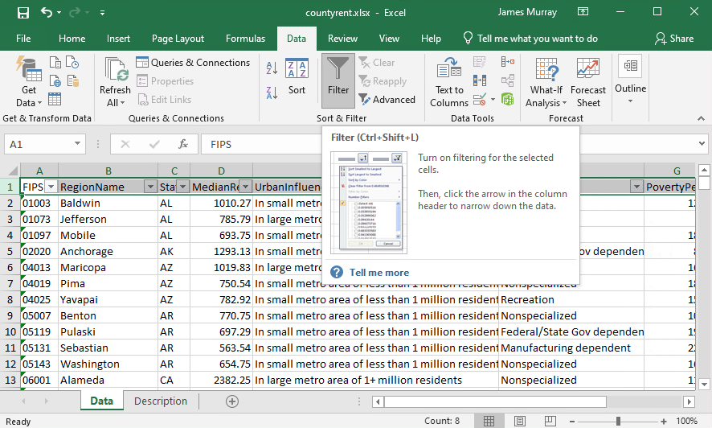

<i><b>Screenshot to create a filter in Microsoft Excel</b></i>

Then select the down arrow button on the cell with the `EconTopology` variable name, and you have the ability to select and deselect (and view!) the categories of the variable. 

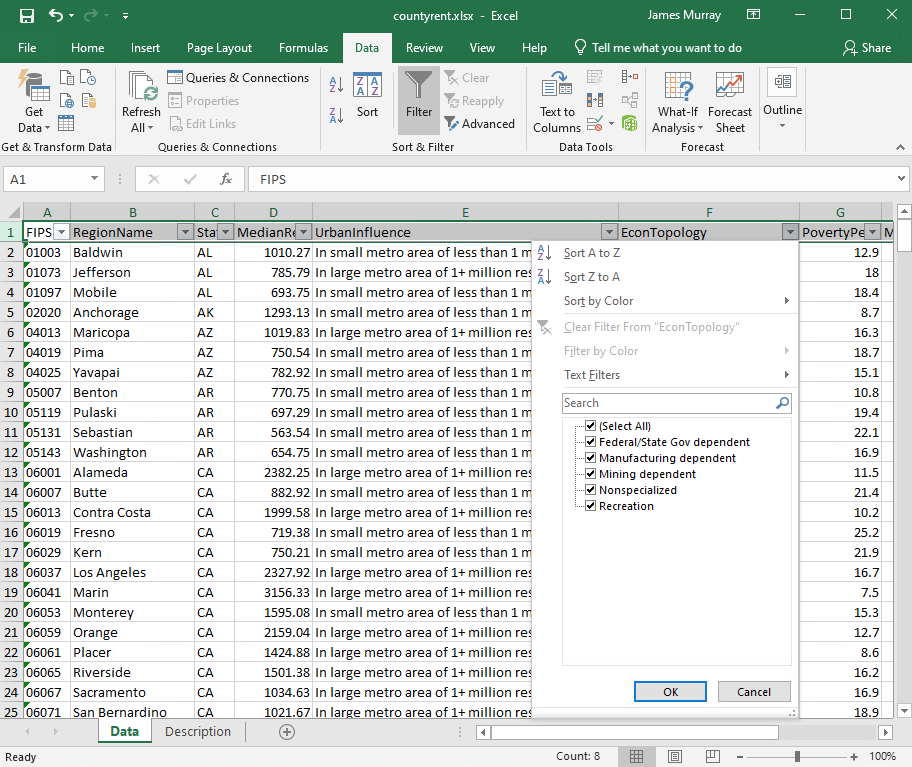

<i><b>Screenshot of Economic Topology categories in Microsoft Excel</b></i>

Doing so shows that `EconTopology` has the following categories:

 - Federal/State government dependent
 
 - Manufacturing dependent
 
 - Mining dependent
 
 - Nonspecialized
 
 - Recreation

You can notice from these descriptions that there is not any meaningful way to order the categories. They are currently given in alphabetical order.

The video below shows how to create a *pivot table* in Microsoft Excel to compute some descriptive statistics for a categorical variable.

<a href="https://www.youtube.com/watch?v=BDUZnG7sgBs" target="_blank"> 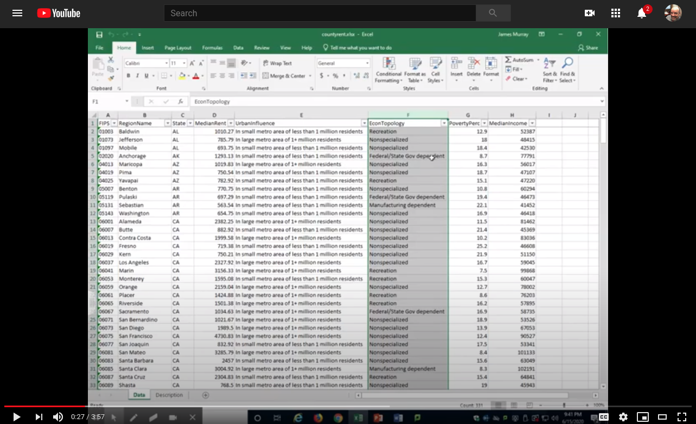</a> 

<a href="https://www.youtube.com/watch?v=BDUZnG7sgBs" target="_blank">https://www.youtube.com/watch?v=BDUZnG7sgBs</a>

<i><b>YouTube video demonstrating how to use MS Excel to create a pivot table with a categorical variable</b></i>

## Ordinal Scale

An ordinal variable is a categorical variable where the categories have a meaningful order, but the distances between values cannot be quantified.

For example, satisfaction scales are typically ordinal:

`Very Satisfied` > `Somewhat Satisfied` > `Somewhat Dissatisfied` > `Very Dissatisfied`. 

Frequency scales are typically ordinal: 

`Every day` > `More than once per week` > `Once per week` > `More than once per month` >

 `Once per month` > `Less than once per month` > `Never`.
 
Ordinal data is different than quantitative data in that differences cannot be quantified. What is the difference between `Somewhat Satisfied` and `Somewhat Dissatisfied`? What is `Somewhat Dissatisfied` minus `Very Dissatisfied`? Are these differences the same? These questions cannot be answered.

As a consequence, and strictly speaking, one cannot compute statistics such as a mean with ordinal data. Calculating a mean requires adding together numbers and dividing.  Adding words, even those that can be ordered, does not have meaning. Instead of computing a mean, you can learn about central tendency with statistics such as the *median*. The median is the middle value when the data is ordered. Since ordinal data can be ordered, the median value can be selected.
 
In the county rent spreadsheet, the variable `UrbanInfluence` is an ordinal variable. It is a measure of how urban or rural a county is. The variable has the following categories:

 - Large metro area of 1+ million residents
 
 - Small metro area of less than 1 million residents
 
 - Micropolitan area adjacent to large metro area
 
 - Micropolitan area not adjacent to a metro area
 
In Excel, an ordinal variable looks like any other categorical variable. Excel does not store information about the order of the categories. We can read these categories and see that there is a natural order. The first category is the highest level of urbanization and the last category is the least urban (the U.S. Census defines micropolitan as an urban area of at least 10,000 residents but less than 50,000).

We can create a pivot table for `UrbanInfluence` following the same procedure as described in the video above. Doing so results in the following pivot table.

<i><b>Screenshot of pivot table for `UrbanInfluence` in Microsoft Excel</b></i>

We can see in our pivot table that Excel put these categories in the incorrect order. The second-most level of urban influence is the last item in the pivot table. Excel does not understand that this is an ordinal variable and automatically put the categories in alphabetical order. The video below shows how to manually reorder the categories to get the proper order.

<a href="https://www.youtube.com/watch?v=higYA0Qj97Q" target="_blank"> 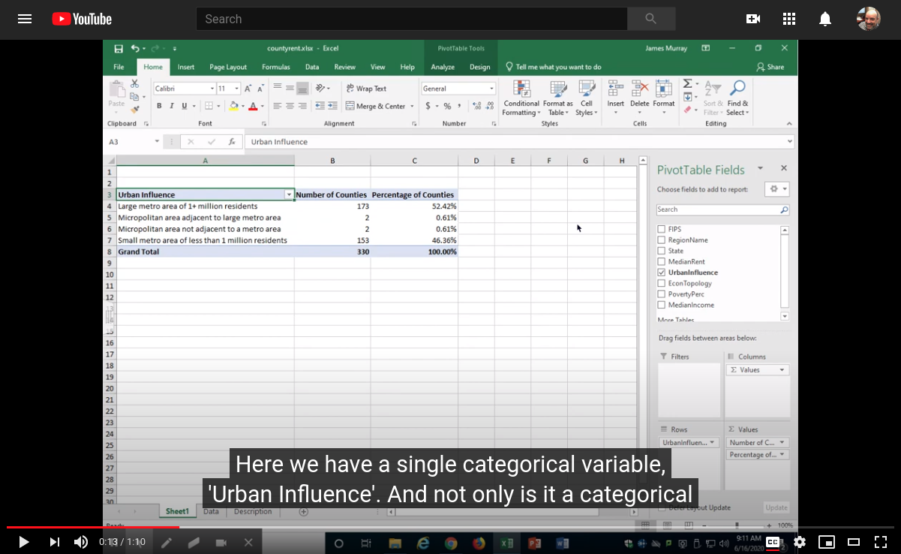</a>

<a href="https://www.youtube.com/watch?v=higYA0Qj97Q" target="_blank">https://www.youtube.com/watch?v=higYA0Qj97Q</a>

<i><b>YouTube video demonstrating how to use MS Excel to reorder items in a pivot table</b></i>

Because ordinal variables can be ordered, it is mathematically convenient to calculate a *median*. A median is a measure of center that is equal to the observation in the center of the distribution. It is often useful to calculate the median of an ordinal variable. For example, universities often calculate the median response of student evaluation of instruction questions that are measured on an ordinal scale.

However, because Excel only recognizes our `UrbanInfluence` variable as text, it does not work to use the `median()` function to calculate the median. The screenshot below shows such an error.

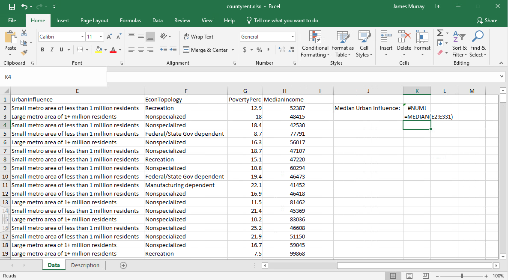

<i><b>Screenshot of error using median function on a categorical variable</b></i>

In order to calculate the median, we have to transform the variable to a numeric value. The following video demonstrates how to make this transformation and calculate the median.

<a href="https://www.youtube.com/watch?v=G-hHYqn4T3U" target="_blank"> 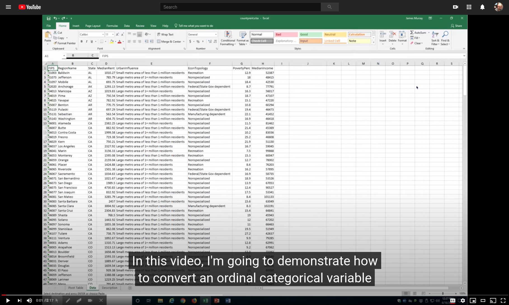</a>

<a href="https://www.youtube.com/watch?v=G-hHYqn4T3U" target="_blank">https://www.youtube.com/watch?v=G-hHYqn4T3U</a>

<i><b>YouTube video demonstrating how to use MS Excel to transform an ordinal variable to a numeric variable</b></i>

The median value equal to 4 implies the highest level of `UrbanInfluence` is the median. In this case, the median urban influence in the sample is a metropolitan area of one million or more residents.

We want to be careful transforming categorical values to numeric values. Once we have a numeric value, it may be tempting to calculate other statistics using this numerical data, like differences or means. But just because it is computationally possible to perform such calculations with a numeric variable, does not make it valid. When we compute means, the calculation implicitly makes assumptions of distances between values. For example, the mean of 4 and 6 is equal to 5, and the mean of 4 and 10 is equal to 7. Because compared to 6, 10 is a larger distance away from 4, the mean of 4 and 10 is a larger number. Distances between ordinal categories are not meaningful. Calculating a mean implicitly assumes the distances between each category are equal to each other, and this may not be a valid assumption.

## Interval Scale

An example of interval data is temperature. A temperature reading of 0 degrees Fahrenheit does not imply an absence of temperature.

For the most part, interval data can be treated like any other quantitative data. It is possible to add, subtract, multiply, and divide, and compute statistics such as means, standard deviations, correlations.

Once exception is that it is not meaningful to compute ratios.  For example, you would not say that 80 deg F is "twice as hot" as 40 deg F.  Even though 80 = 40 x 2, "twice as hot" on an interval scale does not have meaning.  What is twice as hot as 0 deg F? What is twice as hot as -1 deg F? Also, what if we decided to express our temperature in Celsius instead of Fahrenheit. Using our previous example, 44 deg F = 4.44 deg C and 80 deg F = 26.67. When expressed in Fahrenheit, it appears the higher temperature is "twice as hot." When the same levels of heat are expressed in Celsius it appears the higher temperature is $26.67 / 4.44 \approx 6$, or "6 times hotter." These ratios are not meaningful and not appropriate with ordinal data.

There are no interval-scaled variables in the county rent Excel sheet.

## Ratio Scale

There are three ratio variables in the county rent Excel sheet: `MedianRent`, `PovertyPerc`, and `MedianIncome`.

We know that rent is a ratio variable, because a value for zero literally means zero rental price, or free rent.  Just because a value for zero is meaningful, does not imply that value exists in the data set. Still, knowing the zero is meaningful means taking ratios is meaningful. It can be meaningful to say the rent of one unit is twice as high as another unit.

We can view some summary statistics using the Analysis Toolpak add-in for Excel. By default, the Analysis Toolpak is disabled. The following video shows how to enable this add-in.

<a href="https://www.youtube.com/watch?v=vDqo0G_ueEk" target="_blank"> 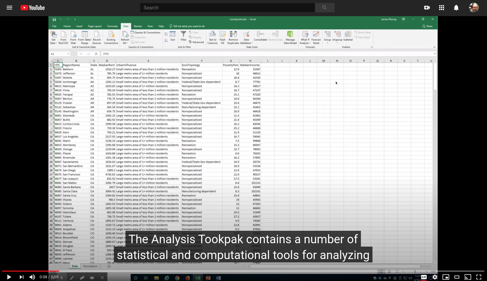</a>

<a href="https://www.youtube.com/watch?v=vDqo0G_ueEk" target="_blank">https://www.youtube.com/watch?v=vDqo0G_ueEk</a>

<i><b>YouTube video demonstrating how to enable the Analysis Toolpak in Excel</b></i>

The Analysis Toolpak contains a number of statistical and computational tools for analyzing data and solving numeric problems. 

The following video shows how to create descriptive statistics for a numeric variable using the Analysis Toolpak.

<a href="https://www.youtube.com/watch?v=c67eNPySbNs" target="_blank"> 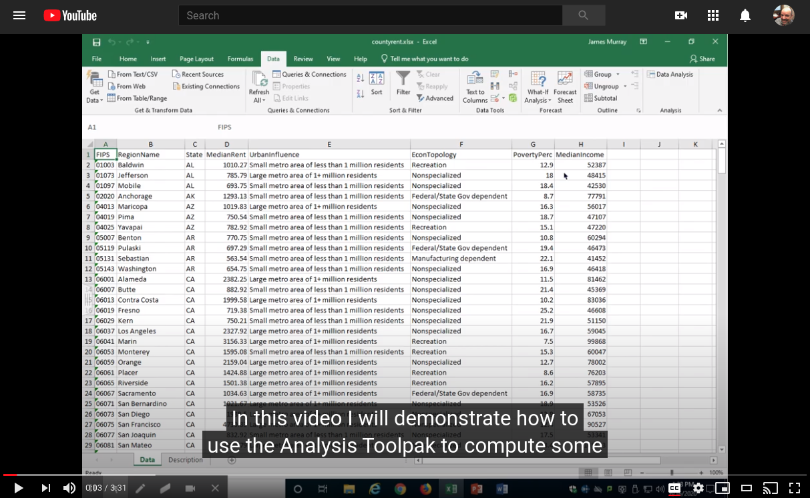</a>

<a href="https://www.youtube.com/watch?v=c67eNPySbNs" target="_blank">https://www.youtube.com/watch?v=c67eNPySbNs</a>

<i><b>YouTube video demonstrating how to create descriptive statistics for a numeric variable using the Analysis Toolpak</b></i>

Following the procedure described in the video, we get the following descriptive statistics:

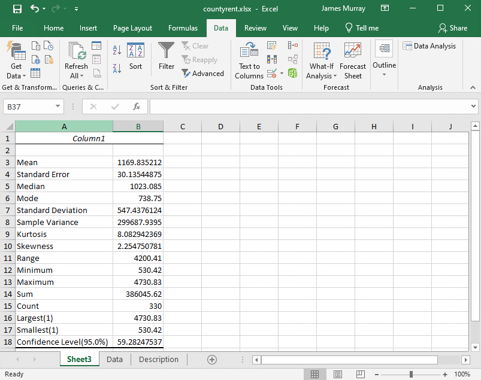

<i><b>Excel screenshot of descriptive statistics</b></i>

We see that the nationwide mean of the median county rental prices is \$1,169.80. The county with the lowest median rental price is has a median rent equal to \$530.40.  The county with the highest median rental price has median rent equal to $4,730.80.

We want to be cautious when interpreting these values.  Each county is given equal weight in these calculations, regardless of the population of the county.  Also, these are rental prices for residences advertised on Zillow.  Rental units in larger counties are more likely to use Zillow for advertising than in small communities.

# Grouping and Summarizing Data 

Suppose we are interested in understanding how median rental prices may depend on economic specialization of a county. We can create a pivot table to group by economic topology and compute a summary value for median rental prices. The video that follows demonstrates how to do this.

<a href="https://www.youtube.com/watch?v=69jpULDLixg" target="_blank"> 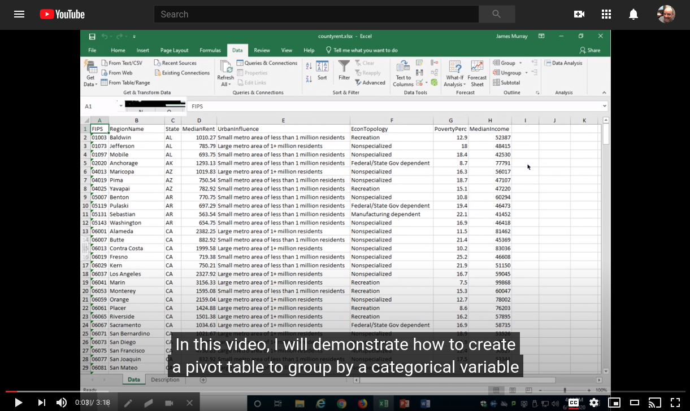</a>

<a href="https://www.youtube.com/watch?v=69jpULDLixg" target="_blank">https://www.youtube.com/watch?v=69jpULDLixg</a>

<i><b>YouTube video demonstrating how to create a pivot table to summarize a numeric variable by categories of a categorical variable</b></i>

Following the instructions in the video results in the following table summarizing average rental prices for each type of economic specialization.

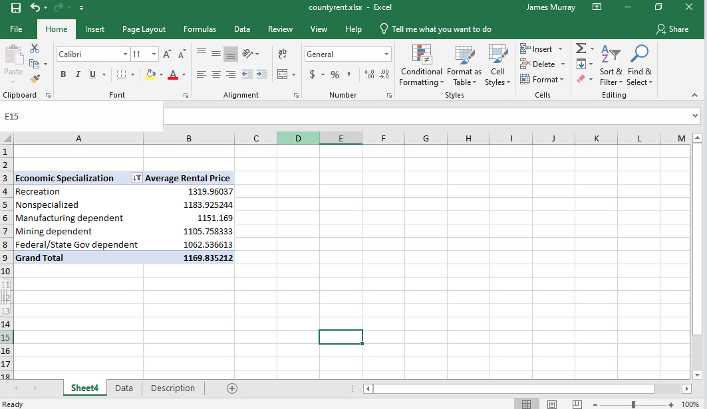

<i><b>Excel screenshot of pivot table summarizing average rental price by economic specialization</b></i>

We can see from the table above, that (at least in our sample) counties that specialize in recreation have on average higher rent than other types of counties.

* * * *

# Self-Check Questions

<ol>
<li> Identify the scale of measurement for each of the following variables.
  <ol type='a'>
    <li> How often each employee thinks explicitly about the mission of an organization while performing usual duties and making decisions at work, measured with the following categories.
      <ul>
        <li> At least once every day </li>
        <li> At least two times per week </li>
        <li> At least once per week </li>
        <li> At least two times per month </li>
        <li> At least once per month </li>
        <li>Less than once per month </li>
      </ul></li>
    <li> Division of a company that an employee works</li>
    <li> Total deposit balances in U.S. dollars of all personal banking customers at a financial institution</li>
    <li> GMAT scores of MBA students (range: 200-800)</li>
  </ol>
</li>

<li> Use the `countyrent.xlsx` spreadsheet and calculate the mean poverty percentage for counties for each type of economic specialization.</li>
  
<li> What summary statistics can you calculate and not calculate for each of the following types of variables?
  <ol type='a'>
    <li> Nominal variables</li>
    <li> Ordinal variables</li>
    <li> Interval variables</li>
    <li> Ratio variables</li>
  </ol></li>
  
</ol>

 