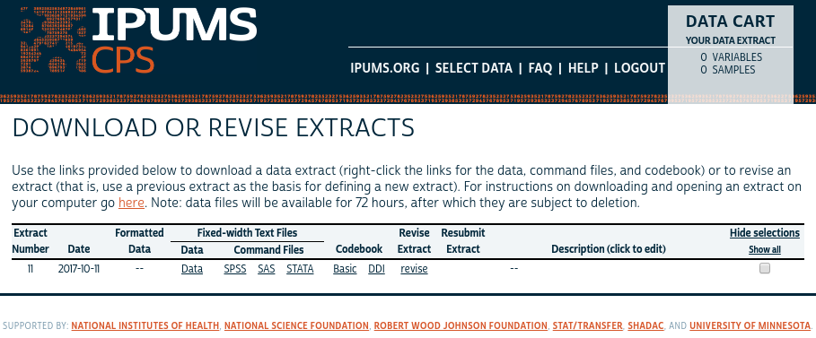
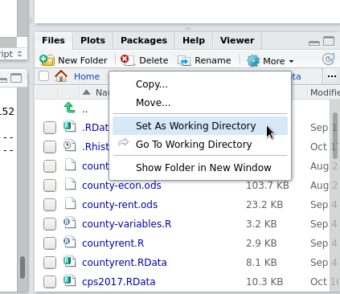
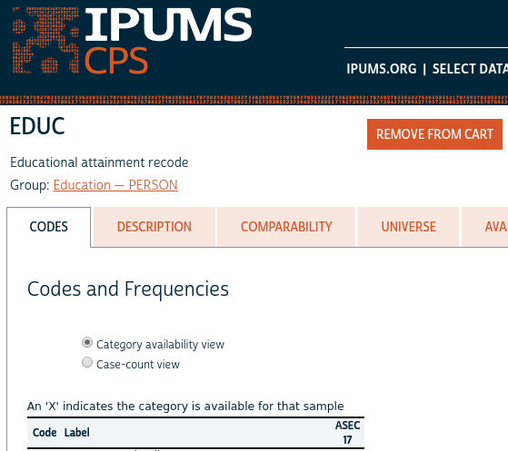
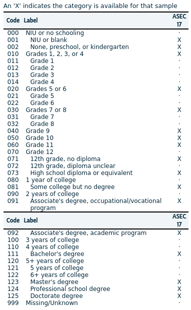
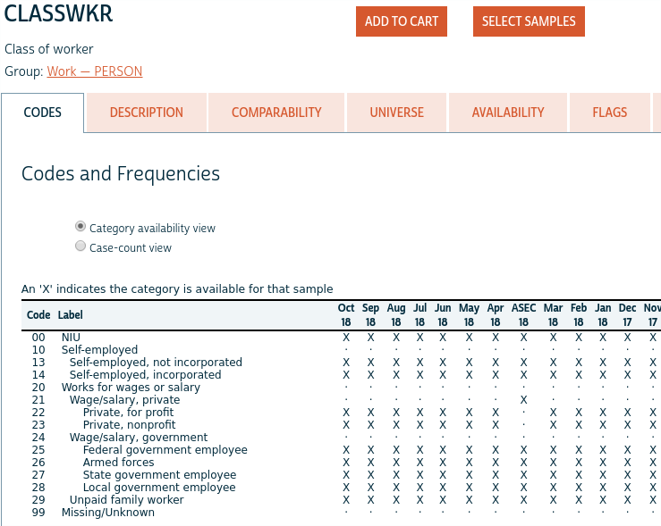
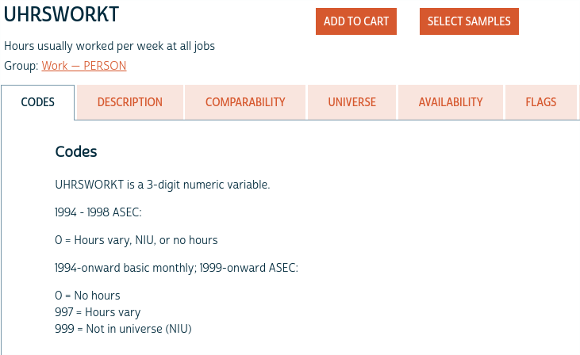
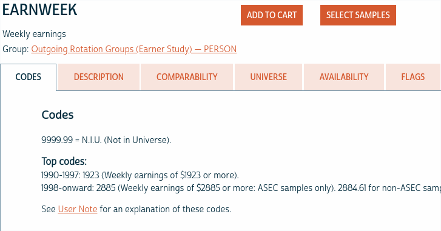

[PDF file location: http://www.murraylax.org/rtutorials/ipumsdata.pdf](http://www.murraylax.org/rtutorials/ipumsdata.pdf)

[HTML file location: http://www.murraylax.org/rtutorials/ipumsdata.html](http://www.murraylax.org/rtutorials/ipumsdata.html)

* * * * 
*Note on required packages:*  The following code requires the packages in the package `SAScii`. This package contains functions to run SAS importation code in R, for the purposes of loading a data set in R designed to be opened in SAS.

`install.packages("SAScii") # This only needs to be executed once for your machine`  

`library("SAScii") # This needs to be executed every time you load R`

* * * * 
```{r,echo=FALSE, include=FALSE}
library("SAScii")
```

## 1. Downloading the Data ##

After you have submitted an extract, you will be brought to a screen like this one:

&nbsp; 


&nbsp; 


The link `data` will not appear immediately. IPUMS will send you an email when your extract is ready. The amount of time this takes depends on the number and size of the samples requested. An extract with a single sample of several thousand observations may only take a minute. It is possible that very large extracts will take an hour or more.

When the `data` link appears, download this file and note the folder in which it is saved. This is a text file that needs to be processed to be opened in any statistical software. The file I downloaded for this tutorial is named `cps_00013.dat.gz`.

Also download the link to the `SAS` command file. This is code for SAS (another statistical software program) that contains the code to process and open the data file. Save this file in the same folder. The file I downloaded for this tutorial is named `cps_00013.sas`.

## 2. Opening the Data ##

In the file viewer in Rstudio, navigate to the folder where you saved the data and SAS script files.  You can navigate to a folder by clicking the `...` button in the upper-right corner of the file viewer. 

Once you have navigated to the correct folder, click on the `More` button above the file viewer, and click `Set As Working Directory`, as shown in the screenshot below.

&nbsp; 



&nbsp; 

The following code processes the data using the SAS script and stores the data as a `data.frame` object called `df`.

`df <- read.SAScii("cps_00013.dat.gz", "cps_00013.sas")`
```{r, include=FALSE}
load("cps13.RData")
```

We can get a quick view of the variable names, the scale of measurement, and the first few observations by passing the data frame `df` to the function `str()`.

```{r}
str(df)
```

The data frame includes 5 variables and more than 185,000 observations.  

## 3. Re-coding Variables ##

A number of the variables include codes for categories and missing observations. In this section, we take a closer look at these variables and discuss how to re-code them to make them usable.

### 3.1 Re-coding to an Ordered Factor: Education ###

The variable `EDUC` is a code between 000 and 125 for the level of education, and includes values of 999 for missing or unknown values. The following screenshots from https://cps.ipums.org/cps-action/variables/EDUC#codes_section show the meaning for each code.

EDUC Page | Codes
- | -
 | 
- | -

Let us start by creating a new variable in our data, called `edu`, which will become an ordered factor with descriptive levels. We initially set all values to the missing value, `NA`

```{r}
df$edu <- NA
```

Next, let us define the following levels.  The following code just creates a short list of strings that will become the levels for `df$edu`.

```{r}
edulevels = c("Less than high school",
              "High school degree or equivalent",
              "Some College",
              "Four Year College Degree",
              "Advanced College Degree")
```

Next, let us assign the observations for the new variable `df$edu` based on the codes in `df$EDUC`.

Those with `EDUC` values less than 73 have less than a high school education. This description is stored in our first element of `edulevels`:
```{r}
df$edu[ df$EDUC<73 ] <- edulevels[1]
```

Next, those with `EDUC` exactly equal to 73 have a high school diploma or equivalent, the second element of `edulevels`:
```{r}
df$edu[ df$EDUC==73 ] <- edulevels[2]
```

These with `EDUC` values greater than 73 and less than 111 have some college, but not a bachelor degree. This is associated with the third element of `edulevels`, "Some College".

```{r}
df$edu[ df$EDUC>73 & df$EDUC<111] <- edulevels[3]
```

Those with `EDUC` values greater than or equal to 111 and less than 123 have a bachelor degree, but not an advanced degree. We associate this with our fourth level, "Four Year College Degree".

```{r}
df$edu[ df$EDUC>=111 & df$EDUC<123] <- edulevels[4]
```

Finally, those with `EDUC` values greater than or equal to 123 have some sort of advanced degree. We associate this with our final level.

```{r}
df$edu[ df$EDUC>=123] <- edulevels[5]
```

Now, we transform the variable `df$edu` to an ordered factor, because it is a categorical variable whose levels have a meaningful order. In the code below, we overwrite `df$edu`, using its own data, specifying the levels the `edulevels`, and specifying that it is ordered.

```{r}
df$edu <- factor(df$edu, levels=edulevels, ordered=TRUE)
```

We can now view the class, levels, and summary of our new variable.
```{r}
class(df$edu)
levels(df$edu)
summary(df$edu)
```

The output to `class(df$edu)` confirms that we have created an ordered factor. The output `levels(df$edu)` shows that our levels for education have been established. Finally, the output of `summary(df$edu)` gives us some frequency statistics regarding our sample.

### 3.2 Re-coding a Factor: Worker Classification ###

The variable, `CLASSWKR`, is a code between 10 and 29 for the type of worker.  The following screenshot from https://cps.ipums.org/cps-action/variables/CLASSWKR#codes_section shows the meaning for each code.


 

We first create a new variable in our data frame and call is `class`. We initially set all values equal to the missing observation code NA.

```{r}
df$class <- NA
```

Those with codes equal to 10 through 14 are self employed. Here we create a category called "Self-Employed" for this group and assign this label to the appropriate observations:

```{r}
df$class[ df$CLASSWKR>=10 & df$CLASSWKR<=14 ] <- "Self-employed"
```

Those with a value for `CLASSWKR` exactly equal to 21 are employed by private companies. Here we create this category and assign this label to the appropriate observations:


```{r}
df$class[ df$CLASSWKR==21 ] <- "Employed by private company"
```

Those with a value for `CLASSWKR` between 24 and 28 have government employers. Here we create this category and assign the label to the appropriate observations:

```{r}
df$class[ df$CLASSWKR>=24 & df$CLASSWKR<28] <- "Employed in Government"
```

Finally, those with a value for `CLASSWKR` exactly equal to 29 are unpaid family workers. Here we create this last category and assign the label to the appropriate observations:

```{r}
df$class[ df$CLASSWKR==29] <- "Unpaid Family Worker"
```

Finally, we will cast our new variable `class` as a factor variable (i.e. a categorical variable):
```{r}
df$class <- factor(df$class)
```

### 3.3 Coding Missing Observations in Numerical Data ###

Usual hours worked per week (`UHRSWORKT`) and weekly earnings (`EARNWEEK`) are both numerical variables, but they both have numeric codes for missing values. 

The following screenshot from IPUMS for the usual hours worked per week variable (https://cps.ipums.org/cps-action/variables/UHRSWORKT#codes_section) shows that the code is numeric, but uses codes 997 for "hours vary" and 999 for "Not in universe (NIU)", i.e. a missing value.



In the code below, we create a new variable called `hrsworked`, set it equal to `UHRSWORKT`. Then, where observations for `UHRSWORKED` are equal to 997 or greater, we set `hrsworked` equal to the missing value code, NA.
```{r}
df$hrsworked <- df$UHRSWORKT
df$hrsworked[ df$UHRSWORKT>=997] <- NA
```

The following screenshot from IPUMS for the weekly earnings variable (https://cps.ipums.org/cps-action/variables/EARNWEEK#codes_section) shows that the code is numeric, but uses code 9999.99 as "Not in Universe," i.e. a missing value.



In the code below, we create a new variable called `earnweek`, set it equal to `EARNWEEK`. Then, where observations for `EARNWEEK` are equal to 9999.99, we set `earnweek` equal to the missing value code, NA.

```{r}
df$earnweek <- df$EARNWEEK
df$earnweek[ df$EARNWEEK == 9999.99 ] <- NA
```

