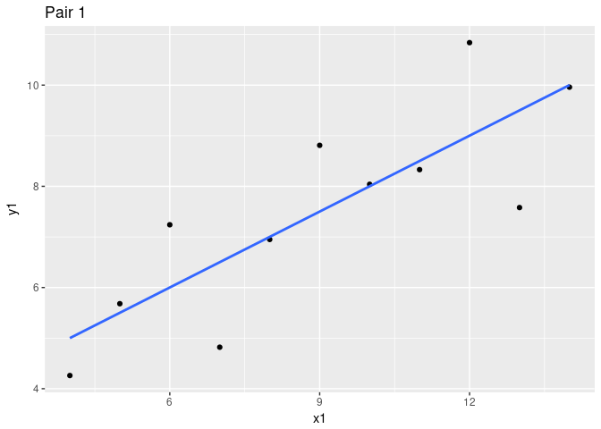
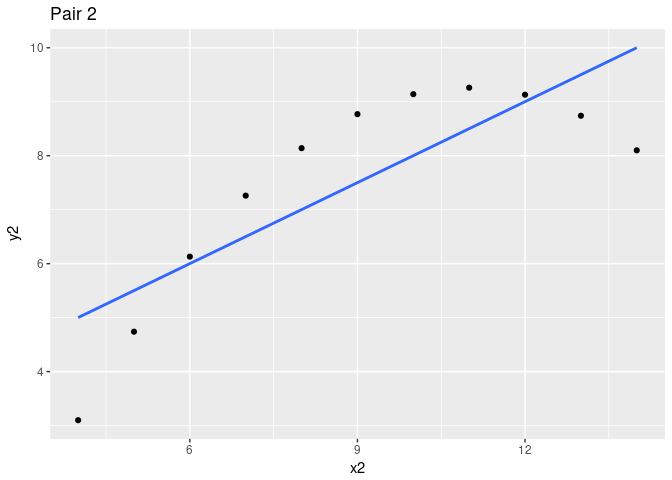
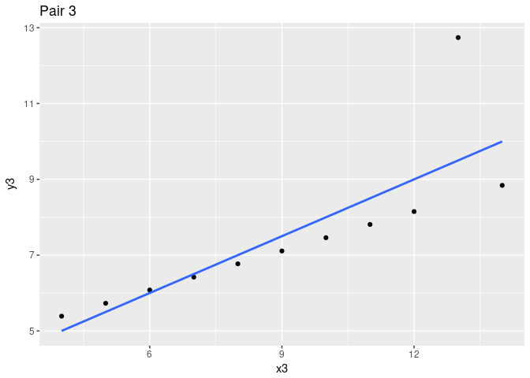
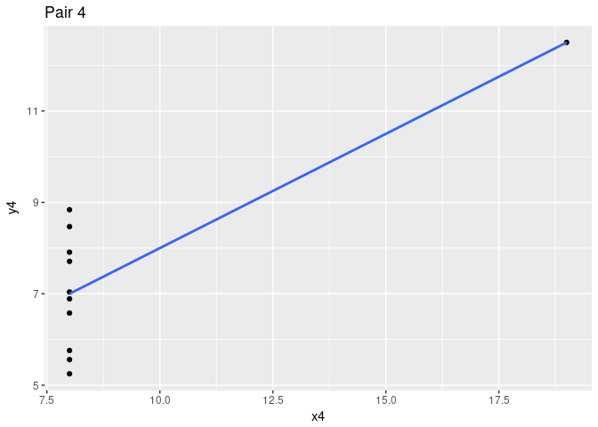
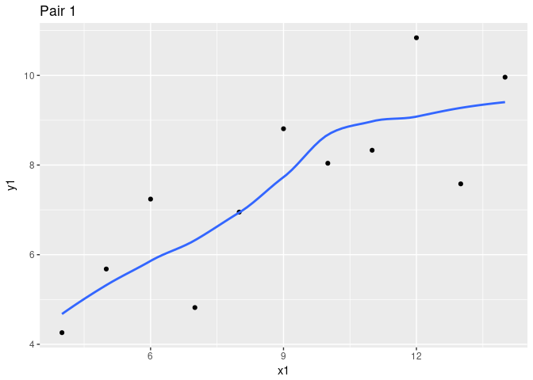
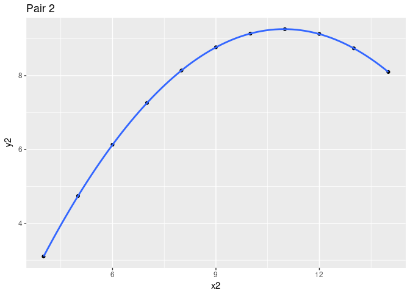
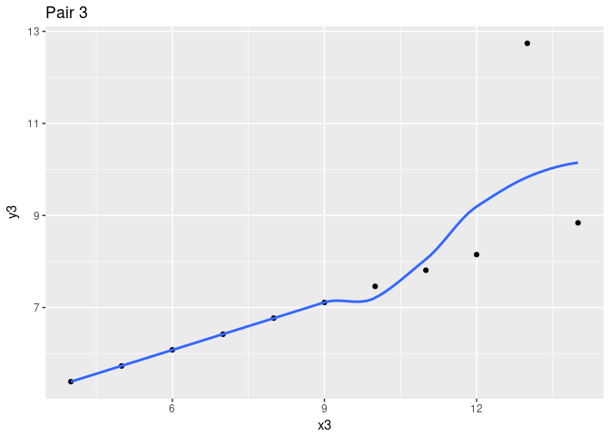

[PDF file location: http://www.murraylax.org/rtutorials/scatter.pdf](http://www.murraylax.org/rtutorials/scatter.pdf)

[HTML file location: http://www.murraylax.org/rtutorials/scatter.html](http://www.murraylax.org/rtutorials/scatter.html)

* * * * 
*Note on required packages:*  The following code requires the packages `tidyverse`, `scales`, `stringr`, `Hmisc`, and `ggthemes`.

* The `tidyverse` package contains many packages that allow you to organize, summarize, and plot data. 

* We use the `scales` library  to customize the scales of our axes. 

* The `ggthemes` package provides multiple themes, which are combinations of parameters to change a plots look and feel 

If you have not already done so, download, install, and load the libraries with the following code:

`install.packages("tidyverse") # This only needs to be executed once for your machine`  

`install.packages("scales") # This only needs to be executed once for your machine` 

`install.packages("ggthemes") # This only needs to be executed once for your machine` 


`library("tidyverse") # This needs to be executed every time you load R`

`library("scales") # This needs to be executed every time you load R`

`library("ggthemes") # This needs to be executed every time you load R`


* * * * 


## 1. Introduction ##

The purpose of a scatter plot is to visually communicate the relationship between numerical (interval or ratio scale) variables. While a correlation coefficient is a statistic that can be used to describe the strength of a linear relationship, a visual can better better describe the nature of relationship and the behavior of the underlying variables.

## 2. Why Visuals? Anscombe's Quartet ##

Anscombe's quartet is a classic example of the drawback to just reporting correlation. Frank Anscombe illusrated in his 1973 *American Statistician* paper (https://www.jstor.org/stable/2682899) how a set of four different pairs of variables can deliver the same correlation coefficient, while the relationships between each pair are completely different.

Anscombe's example data is available in base R. You can view the data quite simply by typing Anscombe's name.

```r
anscombe
```

```
##    x1 x2 x3 x4    y1   y2    y3    y4
## 1  10 10 10  8  8.04 9.14  7.46  6.58
## 2   8  8  8  8  6.95 8.14  6.77  5.76
## 3  13 13 13  8  7.58 8.74 12.74  7.71
## 4   9  9  9  8  8.81 8.77  7.11  8.84
## 5  11 11 11  8  8.33 9.26  7.81  8.47
## 6  14 14 14  8  9.96 8.10  8.84  7.04
## 7   6  6  6  8  7.24 6.13  6.08  5.25
## 8   4  4  4 19  4.26 3.10  5.39 12.50
## 9  12 12 12  8 10.84 9.13  8.15  5.56
## 10  7  7  7  8  4.82 7.26  6.42  7.91
## 11  5  5  5  8  5.68 4.74  5.73  6.89
```

Let us save the $x$ values in one data frame and the $y$ variables in another data frame, then compute the correlation.

```r
x <- anscombe[,1:4]
y <- anscombe[,5:8]
cor(x,y)
```

```
##            y1         y2         y3         y4
## x1  0.8164205  0.8162365  0.8162867 -0.3140467
## x2  0.8164205  0.8162365  0.8162867 -0.3140467
## x3  0.8164205  0.8162365  0.8162867 -0.3140467
## x4 -0.5290927 -0.7184365 -0.3446610  0.8165214
```
The code above pulls out the columns 1 through 4 (and all the rows) and assigned them to `x`, and columns 5 through 8 and assigns them to `y`. Then the call to `cor()` computes the correlation between each x and each y.

Anscombe asks us to focus on the diagonal elements, i.e. the pairs $(x_1, y_1)$, $(x_2, y_2)$, $(x_3, y_3)$, $(x_3, y_3)$. Let us pull out just the diagonal.

```r
diag( cor(x,y) )
```

```
## [1] 0.8164205 0.8162365 0.8162867 0.8165214
```
All the correlations are approximately equal to 0.816.  The scatter plots, though, look much different. The code below creates a scatter plot for each pair and shows the best fit straight line.

```r
ggplot(data=anscombe, mapping=aes(x=x1, y=y1)) + 
  geom_point() + 
  labs(title="Pair 1") + 
  stat_smooth(method="lm", se=FALSE)
```

<!-- -->
These two variables seem to be well represented by a straight line.  We see some points above and some points below, and the spacing of the points from the line does not seem to change as we move along the line.


```r
ggplot(data=anscombe, mapping=aes(x=x2, y=y2)) + 
  geom_point() + 
  labs(title="Pair 2") + 
  stat_smooth(method="lm", se=FALSE)
```

<!-- -->
Clearly a curve would better illustrate this relationship.


```r
ggplot(data=anscombe, mapping=aes(x=x3, y=y3)) + 
  geom_point() + 
  labs(title="Pair 3") + 
  stat_smooth(method="lm", se=FALSE)
```

<!-- -->
A different straight line would represent this relationship better, if not for a single outlier.


```r
ggplot(data=anscombe, mapping=aes(x=x4, y=y4)) + 
  geom_point() + 
  labs(title="Pair 4") + 
  stat_smooth(method="lm", se=FALSE)
```

<!-- -->

All the values for $x$ except one are equal to the same value, not at all dependent on $y$. One value of $x$ is different. This one outlier delivers a positive correlation coefficient and a very deceiving "best fit" line.

While the same straight line relationship is the best fit for each pair, it is clear that each pair of variables have very different relationships with each other.

In the graphs below, we look instead at a LOESS regression curve that best describes the data. LOESS uses nearby points to estimate the shape of the curve so that the curve changes shape as the relationship between $x$ and $y$ change. We exclude the Anscombe's fourth pair, as in this case there is no relationship between the two variables, nor is there even enough variation in $x$ to even estimate the LOESS function.


```r
ggplot(data=anscombe, mapping=aes(x=x1, y=y1)) + 
  geom_point() + 
  labs(title="Pair 1") + 
  stat_smooth(method="loess", se=FALSE)
```

<!-- -->

```r
ggplot(data=anscombe, mapping=aes(x=x2, y=y2)) + 
  geom_point() + 
  labs(title="Pair 2") + 
  stat_smooth(method="loess", se=FALSE)
```

<!-- -->

```r
ggplot(data=anscombe, mapping=aes(x=x3, y=y3)) + 
  geom_point() + 
  labs(title="Pair 3") + 
  stat_smooth(method="loess", se=FALSE)
```

<!-- -->
